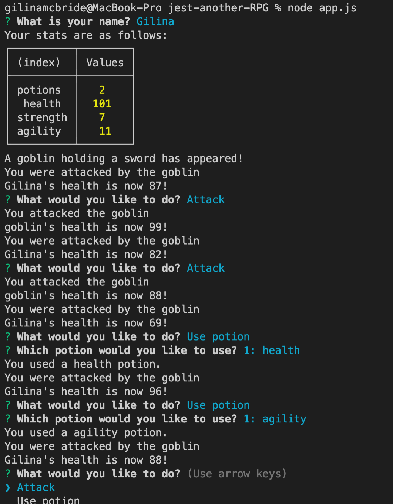

# Jest Another RPG

## Table of Contents

- [Description](#description)
- [Usage](#usage)
- [Application](#application)
- [Questions](#questions)

## Description

Jest Another RPG is a command-line role-playing game created by following the steps of a course module on Inquirer, Object Oriented Programming, and Test Driven Development.

## Usage

Clone the respository and download necessary npm packages. Run "node app.js" and follow the inquirer prompts.

## Application

The following screenshot is from the RPG during game play in the command line.

## Questions?

For any questions, please email gilinamcbride@gmail.com, or visit any other projects on [Github](github.com/gilinamcbride).
